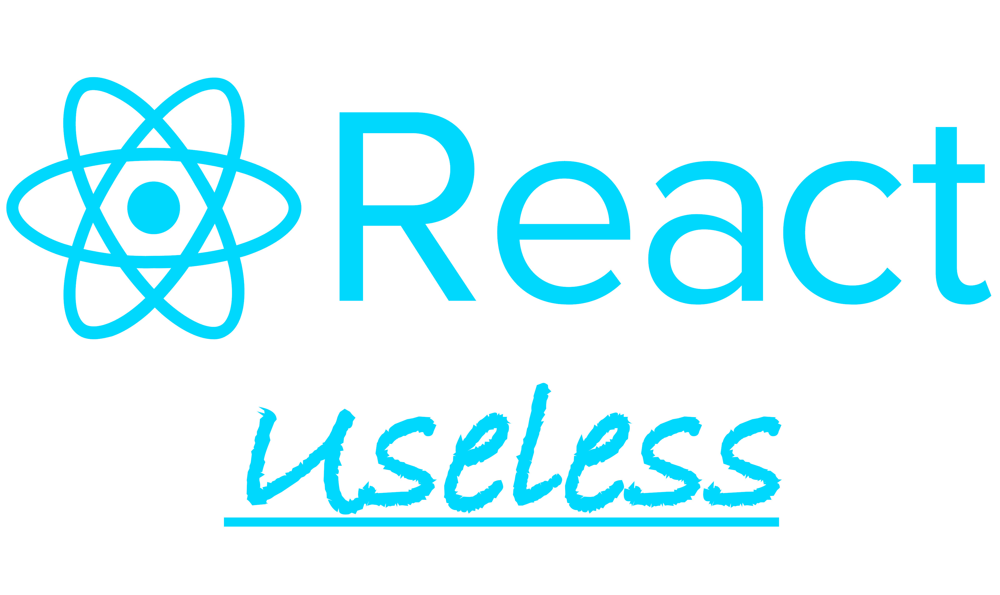

# Useless React

A very useless repository just to prove my skills in React

#### Things I learnt

React is a library, and a library is different from a framework (a library is used in a code, but a code is inserted into a framework).

You can use React as plain library, but it's better if you use an already developed framework with React to speed up the project (for example to build routes or fetch data).

The idea behind these two things is similar to Svelte with SvelteKit or Vue.js with Nuxt.js.

If you want to use one of the recommended frameworks, you can choose between Next.js or Remix.

React builds for web and also for native applications (yes, another one cross-platform frameworks).

 
